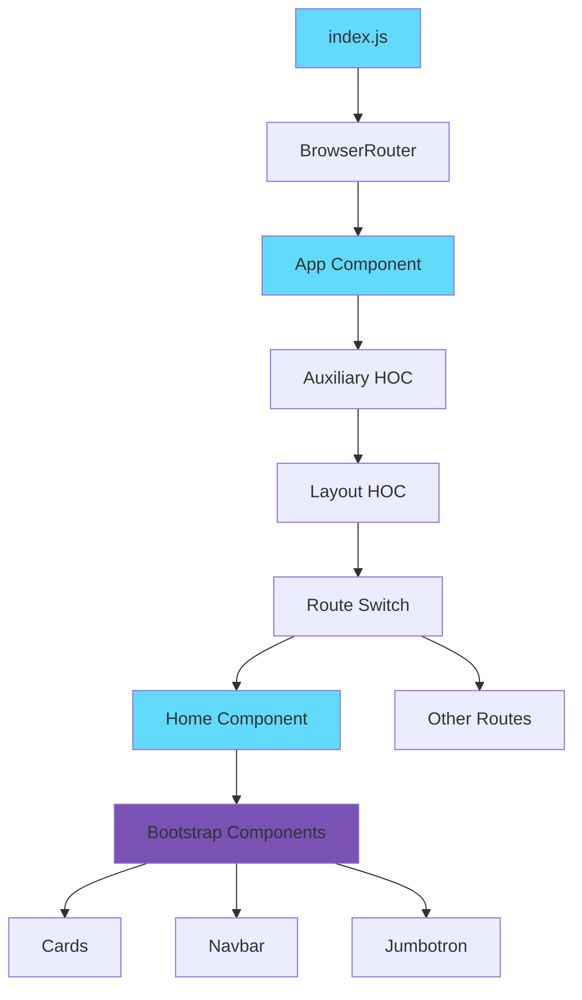
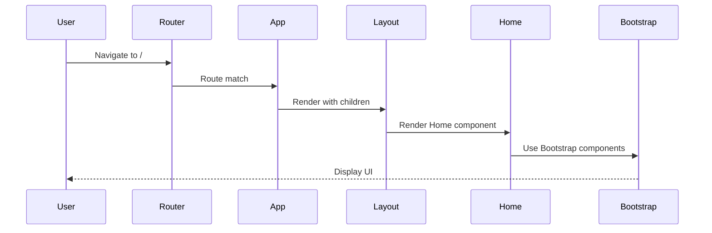

# React Bootstrap 4

A React.js starter kit with Bootstrap 4 integration and SCSS styling. This template provides a clean foundation for building modern web applications with responsive design and component-based architecture.

Built in December 2018. A simple yet powerful boilerplate that combines React's component model with Bootstrap 4's UI framework and custom SCSS styling capabilities.

## Features

- ⚛️ React.js for component-based UI development
- 🎨 Bootstrap 4 for responsive design and pre-built components
- 💅 SCSS for advanced styling with variables and mixins
- 🛣️ React Router for client-side routing
- 📦 Webpack configuration with hot module replacement
- 🔧 Create React App foundation with customizations
- 🎯 Higher-order components (HOC) pattern
- 📱 Mobile-responsive layout

## Getting Started

### Prerequisites

- Node.js (v8 or higher)
- npm or yarn

### Installation

1. Clone the repository:
```bash
git clone https://github.com/orassayag/react-bootstrap-4.git
cd react-bootstrap-4
```

2. Install dependencies:
```bash
npm install
```

3. Start the development server:
```bash
npm start
```

The application will open at [http://localhost:3000](http://localhost:3000)

## Available Scripts

### Start
Runs the app in development mode with hot reloading:
```bash
npm start
```

### Build
Creates an optimized production build:
```bash
npm run build
```

### Test
Launches the test runner in interactive watch mode:
```bash
npm test
```

## Project Structure

```
react-bootstrap-4/
├── public/
│   ├── index.html          # HTML template
│   ├── manifest.json       # PWA manifest
│   └── favicon.ico         # App icon
├── src/
│   ├── containers/         # Page-level components
│   │   ├── App/           # Main app container with routing
│   │   └── Home/          # Home page with album example
│   ├── hoc/               # Higher-order components
│   │   ├── Layout/        # Layout wrapper
│   │   └── Auxiliary/     # Auxiliary wrapper
│   ├── index.js           # Application entry point
│   └── serviceWorker.js   # PWA service worker
├── config/                 # Webpack configuration
├── scripts/               # Build scripts
└── package.json
```

## Architecture



## Component Flow



## Using Bootstrap Components

This template includes Bootstrap 4. Use Bootstrap classes directly:

```jsx
<div className="container">
    <div className="row">
        <div className="col-md-6">
            <button className="btn btn-primary">Click Me</button>
        </div>
    </div>
</div>
```

## Custom Styling with SCSS

Each component can have its own SCSS file:

```scss
.home {
    background-color: #f5f5f5;
    
    &__header {
        padding: 2rem;
    }
    
    &__content {
        margin: 1rem 0;
    }
}
```

## Adding New Components

1. Create a new folder in `src/containers/`
2. Add `ComponentName.jsx` and `ComponentName.scss`
3. Export from `src/containers/index.js`
4. Add route in `src/containers/App/App.jsx`

## Built With

* [React.js](https://reactjs.org) - JavaScript library for building user interfaces
* [Bootstrap 4](https://getbootstrap.com) - CSS framework for responsive design
* [React Router](https://reactrouter.com) - Routing library for React
* [Node-sass](https://github.com/sass/node-sass) - SCSS compiler
* [Webpack](https://webpack.js.org) - Module bundler
* [Git](https://git-scm.com) - Source management

## Contributing

Contributions to this project are [released](https://help.github.com/articles/github-terms-of-service/#6-contributions-under-repository-license) to the public under the [project's open source license](LICENSE).

Everyone is welcome to contribute. Contributing doesn't just mean submitting pull requests—there are many different ways to get involved, including answering questions and reporting issues.

Please feel free to contact me with any question, comment, pull-request, issue, or any other thing you have in mind.

## Author

* **Or Assayag** - *Initial work* - [orassayag](https://github.com/orassayag)
* Or Assayag <orassayag@gmail.com>
* GitHub: https://github.com/orassayag
* StackOverflow: https://stackoverflow.com/users/4442606/or-assayag?tab=profile
* LinkedIn: https://linkedin.com/in/orassayag

## License

This application has an MIT license - see the [LICENSE](LICENSE) file for details.
